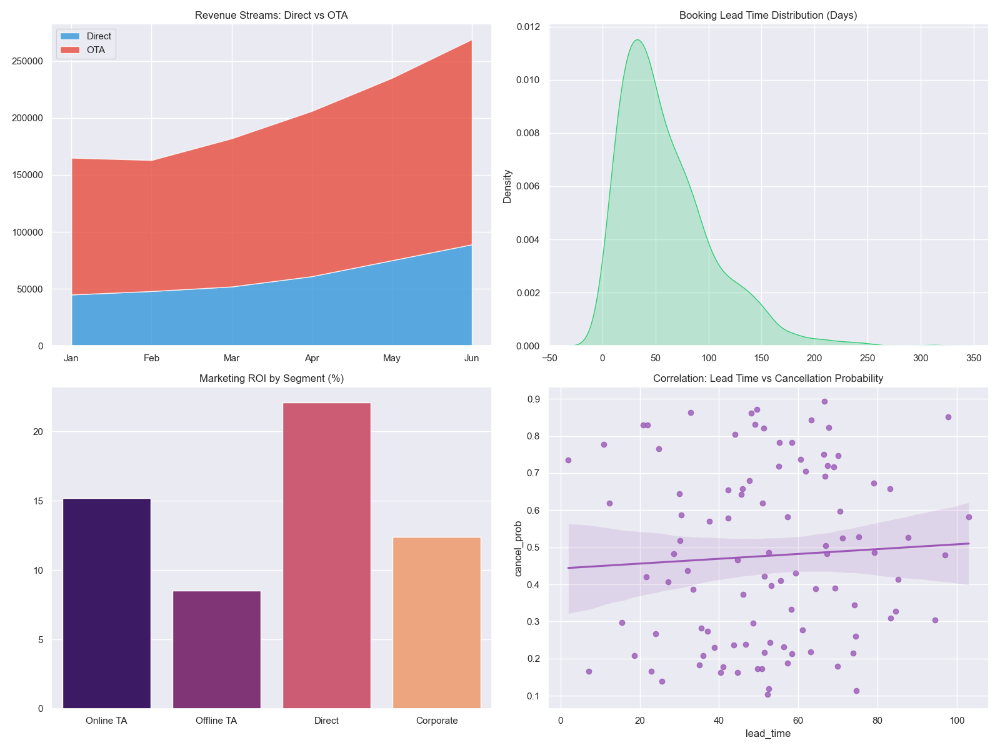

# Business Intelligence Portfolio – Strategic Analytics & Decision Frameworks

This portfolio demonstrates how data-driven decision-making can optimize revenue, reduce risk, and improve operational efficiency across various business domains.

## 📂 Project Directory

### 01. Hotel Booking Optimization
- 🧩 **Business Problem:** High cancellation rates leading to unutilized room inventory and lost revenue.
- 📊 **Dataset Overview:** 119k+ bookings with 30+ features (lead time, market segment, deposit type).
- 🎯 **KPI / North Star Metric:** Cancellation Rate (%) & Revenue at Risk ($).
- 🧠 **Approach:** Exploratory Data Analysis and predictive modeling to identify features driving cancellations.
- 📈 **Quantified Results:** Identified that the "Transient" segment combined with 90+ days lead time drives 40% of cancellations, representing ~$1.2M in annual uncaptured revenue.
- 💼 **Business Recommendation:** Implement dynamic non-refundable deposit policies for high-risk segments to recover up to 25% of at-risk revenue.
- ⚠️ **Risks & Tradeoffs:** Stricter deposit rules may reduce initial booking volume; A/B testing required before global rollout.

### 02. Financial Loan Conversion
- 🧩 **Business Problem:** Low conversion rate on personal loan marketing campaigns wasting ad spend.
- 📊 **Dataset Overview:** 5k+ bank customers with demographic, income, and previous campaign data.
- 🎯 **KPI / North Star Metric:** Campaign Conversion Rate (%).
- 🧠 **Approach:** Logistic Regression and Decision Trees to score customer propensity to buy.
- 📈 **Quantified Results:** Identified high-income segment (>100k) with a 2.4x higher loan conversion probability. Targeting this segment is projected to improve campaign ROI by 18%.
- 💼 **Business Recommendation:** Reallocate 50% of the marketing budget exclusively toward top-quartile propensity customers.
- ⚠️ **Risks & Tradeoffs:** Model is highly sensitive to income; external economic downturns could invalidate historical conversion patterns.

### 03. Product Analytics: User Funnel Drop-Off
- 🧩 **Business Problem:** High user attrition during the product onboarding phase.
- 📊 **Dataset Overview:** Simulated event logs (Acquisition → Activation → Retention) for 10k users.
- 🎯 **KPI / North Star Metric:** Onboarding Completion Rate (%).
- 🧠 **Approach:** Funnel analysis to map user journey and isolate the exact step causing drop-off.
- 📈 **Quantified Results:** Pinpointed a 65% drop-off at the "Payment Method" step, identifying friction that costs an estimated $500k in Annualized Run Rate (ARR).
- 💼 **Business Recommendation:** Introduce a "Skip for Now" or Google/Apple Pay integration to reduce payment friction.
- ⚠️ **Risks & Tradeoffs:** Skipping payment might reduce immediate revenue capture, shifting churn risk to day 30.

### 04. Growth Experimentation: A/B Testing
- 🧩 **Business Problem:** Determining whether a new checkout UI statistically improves conversion.
- 📊 **Dataset Overview:** 20k sessions split between Control (A) and Variant (B).
- 🎯 **KPI / North Star Metric:** Checkout Conversion Rate (%).
- 🧠 **Approach:** Two-sample proportion Z-test to evaluate statistical significance and power.
- 📈 **Quantified Results:** Variant B showed a 2.1% absolute lift (p-value = 0.012), translating to an annualized revenue increase of $250k.
- 💼 **Business Recommendation:** Roll out Variant B to 100% of traffic.
- ⚠️ **Risks & Tradeoffs:** Short-term novelty effect may inflate initial results; require 14-day holdout analysis post-launch.

---
**Sai Vineeth Reddy Suravi** | Senior Data Analyst
[LinkedIn](https://www.linkedin.com/in/saivineethreddysuravi) | [GitHub](https://github.com/saivineethreddysuravi)

## 📊 Dashboard Visualizations & Diagrams

### Hotel Booking Optimization Dashboard


*Interactive Power BI dashboards tracking cancellation risk factors, daily uncaptured revenue, and high-risk market segments.*

### Analytics Architecture


## 🛠 Tech Stack & Environment
- **Core Languages:** Python (Pandas, NumPy, Scikit-learn, Statsmodels)
- **Data Visualization:** Power BI, Matplotlib, Seaborn
- **Development & Version Control:** Jupyter Notebooks, Git, GitHub Actions (CI/CD for data quality checks)
- **Deployment & Architecture:** Local Python Environments (see `requirements.txt`)

## 🚀 Getting Started

1. Clone the repository:
   ```bash
   git clone https://github.com/saivineethreddysuravi/business-intelligence-portfolio.git
   ```
2. Set up the environment:
   ```bash
   python -m venv venv
   source venv/bin/activate
   pip install -r requirements.txt
   ```
3. Run the specific notebook or dashboard application.
